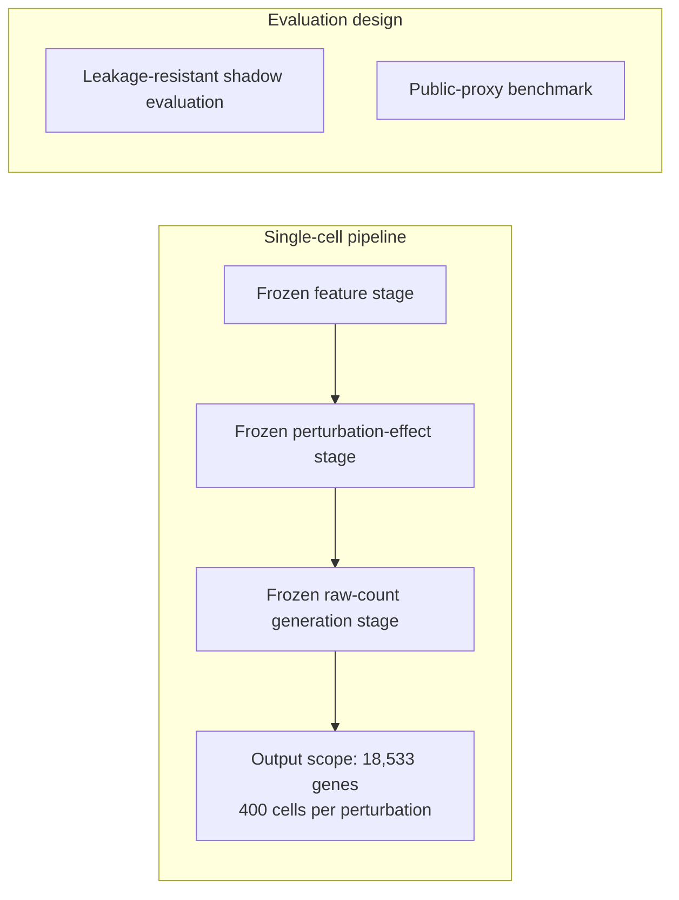

# Virtual Cell Challenge 2026

**Research brief / implementation not included in this release**

Zero-shot perturbation prediction with a submission-ready single-cell pipeline and evaluation designed to resist data leakage.

Jiheon Kang leads a six-member team working on this project. This brief records the scope and results reported in his CV, updated September 2026.

| Project | Details |
|---|---|
| Status | Ongoing · 2026–present |
| Role | Team Lead |
| Team | 6 members |
| Task | Zero-shot perturbation prediction |
| Pipeline output scope | 18,533 genes · 400 cells per perturbation |

## Research approach

The project includes a submission-ready single-cell pipeline with frozen feature, perturbation-effect, and raw-count generation stages. Its evaluation design combines leakage-resistant shadow evaluation with a public-proxy benchmark.

The schematic summarizes the CV's stage descriptions. It does not specify an architecture, configuration, or runnable workflow.

## Reported result

| Metric | Value | Evaluation context |
|---|---:|---|
| PDS | 0.5794 | Jiang24 IFNG/BxPC3 public-proxy benchmark |

**The PDS value is a proxy result, not an official leaderboard score.** The gene and cell counts describe the pipeline's output scope; they are not performance metrics. See [Evaluation scope](docs/evaluation-scope.md) for the boundaries of this result.

## Code availability

Implementation is not included in this release. This repository contains a research brief and evaluation-scope documentation; it does not contain executable pipeline code, datasets, checkpoints, or submission artifacts. “Submission-ready” describes the pipeline reported in the CV, not the contents of this documentation release.

## 한국어 소개

강지헌이 6인 팀의 팀장으로 참여하는 제로샷 세포 교란 예측 프로젝트입니다. 특징 추출, 교란 효과 추정, 원시 카운트 생성 단계를 고정한 단일세포 파이프라인과 데이터 누출을 고려한 평가를 구축했습니다. 파이프라인은 유전자 18,533개와 교란당 세포 400개를 다룹니다.

Jiang24 IFNG/BxPC3 공개 프록시 벤치마크에서 PDS 0.5794를 기록했으며, 공식 리더보드 점수가 아닙니다. 이 저장소는 연구 개요 문서로, 구현 코드는 이번 공개본에 포함하지 않습니다.

---

[Jiheon Kang's portfolio](https://heoneyzi.github.io/) · [GitHub](https://github.com/heoneyzi)
